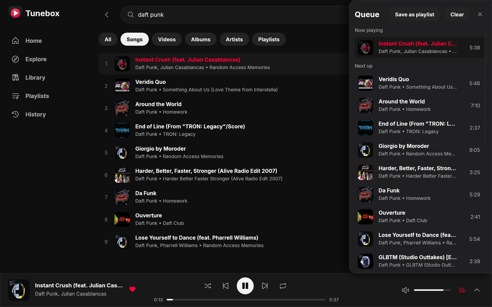
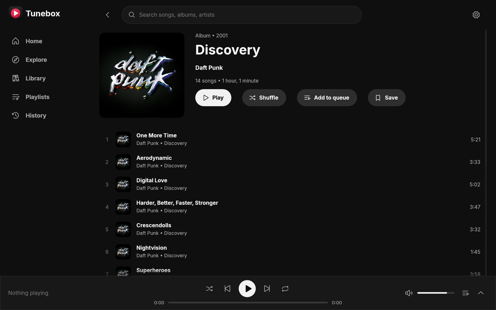
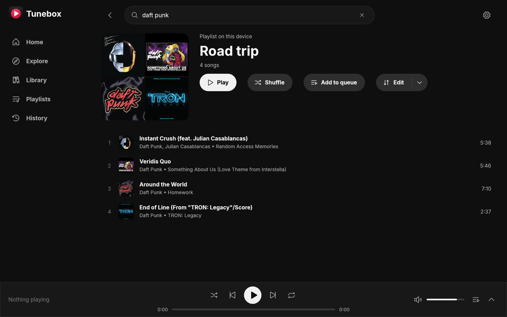
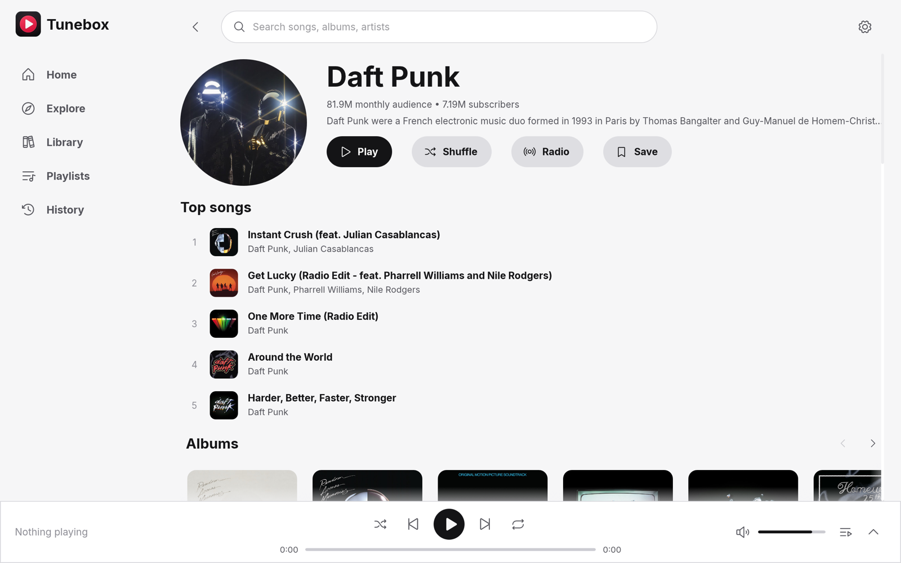
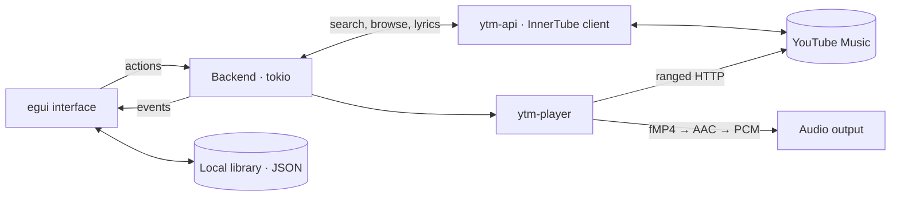

<p align="center">
  
</p>

<h1 align="center">Tunebox</h1>

<p align="center">
  <strong>YouTube Music, as a real desktop app.</strong><br />
  No browser, no Electron, no account. Opens in a blink and stays light.
</p>

<p align="center">
  <a href="https://github.com/MBrkA/tunebox/actions/workflows/ci.yml"></a>
  <a href="LICENSE"></a>
  
  
</p>

<p align="center">
  <a href="../../releases"><strong>Download</strong></a> ·
  <a href="docs/USER_GUIDE.md">User guide</a> ·
  <a href="#build-from-source">Build from source</a> ·
  <a href="docs/DEVELOPMENT.md">Contribute</a>
</p>

<p align="center">
  
</p>

## Why Tunebox?

The YouTube Music website is a full browser tab: hundreds of megabytes of RAM and a fan that spins up when you just
want some music. Tunebox talks to YouTube directly, decodes the audio itself and draws its own interface, so it
**opens its first frame in about 100 ms and idles at roughly 100 MB of memory**.

| | What you get |
| --- | --- |
| **Find anything** | Search with suggestions; browse Home, Explore (new releases, charts, moods & genres), artists, albums and playlists. |
| **Just press play** | Queue you can reorder, shuffle, repeat, gapless playback and endless "up next" radio. |
| **Sing along** | Time-synced lyrics that follow the song, with plain lyrics as a fallback. |
| **No sign-in, ever** | Likes, playlists, saved albums/artists and listening history stay on your computer. Nothing to log into, nothing to track you. |
| **Feels native** | Media keys and system "Now Playing" controls, tray icon with play/pause/next, song-change notifications. |
| **Make it yours** | Dark and light themes (or follow the system), six languages (English, Türkçe, Deutsch, Español, Français, 中文), HiDPI, works down to 640×480. |
| **Keyboard friendly** | `Space` to play/pause, `Ctrl`+`K` to search, press **?** for every shortcut. |

<table>
  <tr>
    <td></td>
    <td></td>
  </tr>
  <tr>
    <td align="center"><em>Albums and artists, one click to play or shuffle</em></td>
    <td align="center"><em>Your own playlists, stored locally</em></td>
  </tr>
  <tr>
    <td colspan="2"></td>
  </tr>
  <tr>
    <td colspan="2" align="center"><em>Light theme</em></td>
  </tr>
</table>

## Get started

1. Download Tunebox for your system from [Releases](../../releases):

   | System | Download | Notes |
   | --- | --- | --- |
   | **Ubuntu 24.04** (x86_64) | `.deb` | `sudo apt install ./tunebox_*.deb` |
   | **macOS** (Apple Silicon) | `.pkg` | Not notarised: the first time, open it via System Settings → Privacy & Security → *Open Anyway*. |
   | **Windows 10/11** (x64) | `.zip` | Unzip and run `tunebox.exe`. Unsigned, so SmartScreen will warn. |

2. Open Tunebox and search for a song, artist or album (`Ctrl`+`K` or `/`).
3. Press play. Heart songs to like them, right-click to *Add to playlist*.

Your library lives in a folder on your computer (Settings → Application data shows it, can move it and back it up).
On GNOME the tray icon needs the AppIndicator extension, which Ubuntu ships enabled. More in the
[user guide](docs/USER_GUIDE.md).

> **Status:** Ubuntu 24.04 is the tested platform. macOS builds and runs but has only been lightly tested, and the
> Windows build has not been run yet. Reports are welcome.

## Good to know

* Tunebox uses YouTube's unofficial API, so a YouTube change can break it without notice. If
  [`yt-dlp`](https://github.com/yt-dlp/yt-dlp) is installed, it is used as a fallback for playback.
* No downloads or offline mode, and your library does not sync between devices.
* What has been verified on which system: [docs/STATUS.md](docs/STATUS.md).

## Light by design

Absolute numbers rather than CPU percentages (a percentage depends on core count, clock speed and OS, so it doesn't
compare across machines). Release build, 20-track queue unless noted. Reproduce with the
[`tunebox-ui-capture`](.claude/skills/tunebox-ui-capture/SKILL.md) scripts.

| Metric | Value | Measured on |
|---|---|---|
| Cold start to first frame | ≈ 100 ms | Linux |
| UI work per frame | ≈ 0.65 ms (about 3 repaints/s while playing, so ≈ 2 ms of UI CPU per second) | Linux |
| Idle CPU time | 0.23 s of CPU over 30 s (≈ 8 ms per second), window open, nothing playing | Apple M2, macOS |
| Memory (RSS) | ≈ 140 MB (GPU renderer) / ≈ 210 MB (software rasteriser) | Linux |
| Memory (RSS), idle window | ≈ 102 MB | Apple M2, macOS |
| Executable | 29 MB (macOS arm64), ≈ 27 MB (Windows) | release builds |

These are single runs by the author, not a benchmark suite, and not a head-to-head against the web player. To compare
on your own machine, run Tunebox and music.youtube.com side by side and add up the process totals in Activity
Monitor / `htop` (every renderer and helper process for the browser, not just the tab).

## How it works



| Crate | Role |
| --- | --- |
| `ytm-app` | The `tunebox` app: interface, local library, tray, media keys, notifications |
| `ytm-api` | YouTube Music client and parsers, stream resolution |
| `ytm-player` | Queue, streaming source, fMP4 demuxer, AAC decoding, audio output |
| `ytm-core` | Settings and logging |

[Architecture](docs/ARCHITECTURE.md) · [Decisions, with measurements](docs/DECISIONS.md) ·
[Development guide](docs/DEVELOPMENT.md)

## Build from source

Needs Rust 1.95+.

```sh
# Ubuntu 24.04
sudo apt install build-essential pkg-config libasound2-dev libssl-dev libdbus-1-dev \
  libxkbcommon-dev libwayland-dev libgl1-mesa-dev libxcb-render0-dev libxcb-shape0-dev \
  libxcb-xfixes0-dev libgtk-3-dev
# macOS: xcode-select --install

git clone https://github.com/MBrkA/tunebox.git
cd tunebox
cargo build --release
./target/release/tunebox
```

Before sending a change, keep these green:

```sh
cargo fmt --all --check
cargo clippy --workspace --all-targets --all-features -- -D warnings
cargo test --workspace
```

## Disclaimer

Tunebox uses YouTube's *unofficial* InnerTube API and may conflict with the YouTube / YouTube Music Terms of Service.
It is for personal use only, does not bypass paid-tier restrictions or DRM, and does not download or export media.
Not affiliated with or endorsed by Google or YouTube.

## License

MIT, see [LICENSE](LICENSE).
